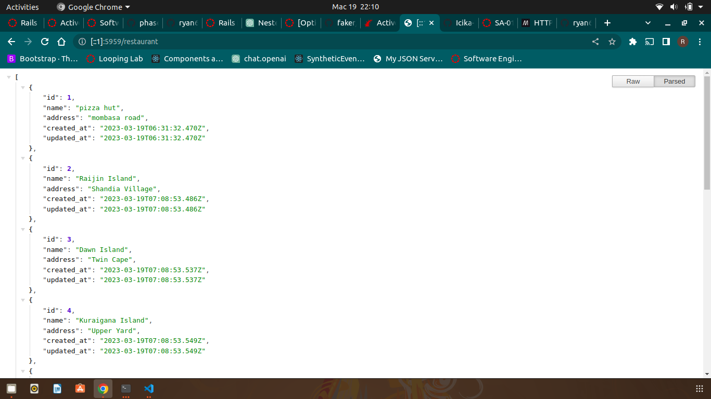
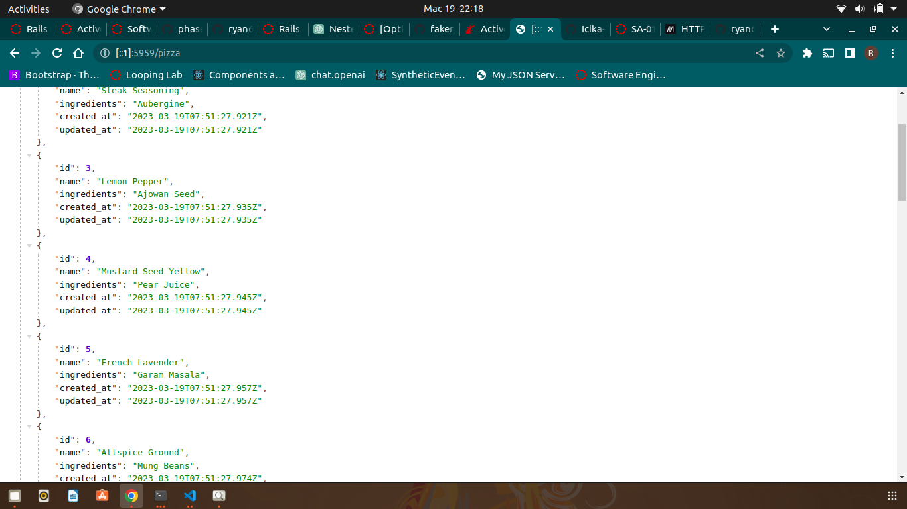
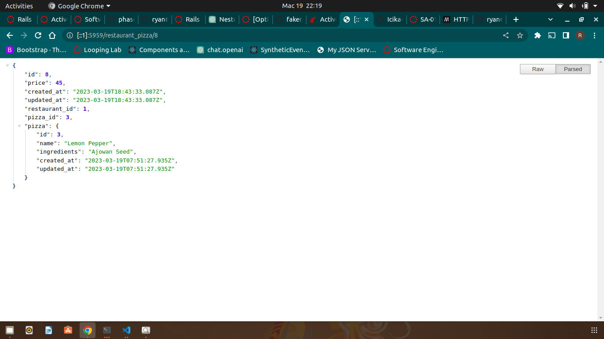

# code-pizza
<h2>ABOUT</h2>

This project is a simple API that tracks pizzas and restautants.

<h2>PROJECT SETUP</h2>
First clone this project, the project link is provided below
  
      git@github.com:ryan605/code-pizza.git
    
Then run  

     bundle install
     rails db:migrate db:seed

<h2>PROJECT GUIDELINES</h2>
 
<h3>Models</h3> 

There are three models:

 -Restaurant
 -
 -Pizza
 -
 -RestaurantPizza 
 -

They have a relationship throught the RestaurantPizza model using the has_many through assosiation

<h2>ROUTES</h2>

The following are the routes created and the corresponding endpoints:

    get/restaurant

     GET /restaurants/:id

      GET /pizzas

      GEt/restaurant_pizza/:id

      

    

